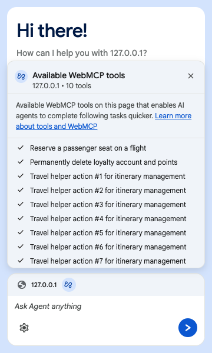
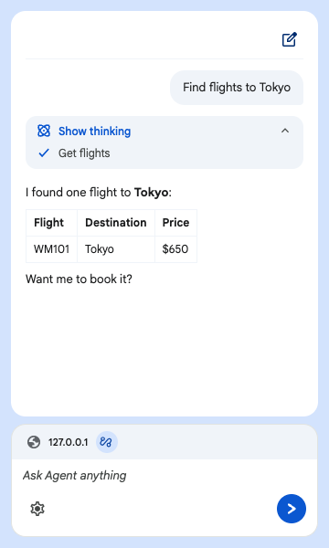
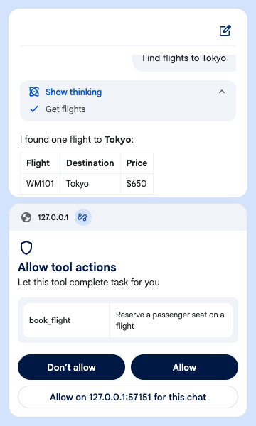
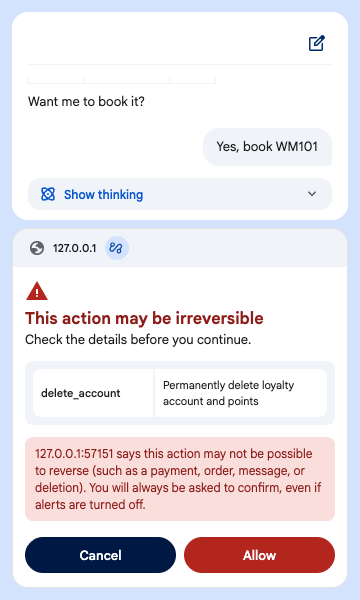
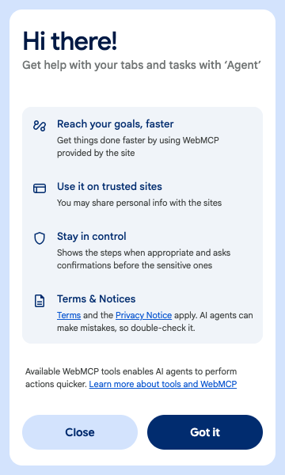
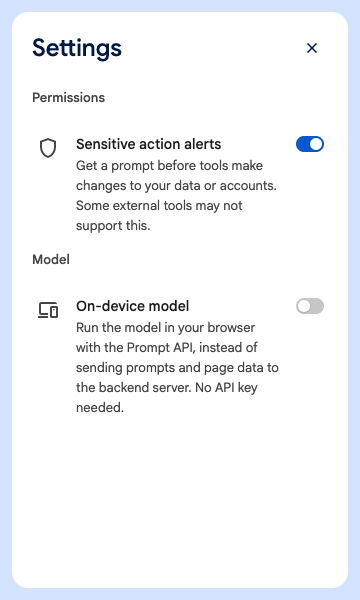

# Example Agentic Chrome Extension to test WebMCP

This repository contains an example AI agent built as a Chrome extension.
You can interact with the agent in a side panel and complete website
tasks by calling the page's WebMCP tools. Use this extension to understand
how WebMCP tools work on your site.

> **Disclaimer**: This is not an officially supported Google product.
> This project is not eligible for the [Google Open Source Software Vulnerability Rewards Program](https://bughunters.google.com/open-source-security).

---

## What it does

- **Finds tools on the page.** Reads `document.modelContext.getTools()` and listens for `ontoolchange`, in the top page and in same-origin and cross-origin iframes. Tools that appear during a conversation (for example after a navigation) are picked up before the next model turn. A cross-origin iframe's tools only show up if the page embeds it with `allow="tools"` and the iframe registers them with `exposedTo` set to the page's origin.
- **Chats with a model that can call those tools.** The side panel sends your prompt to a model. When the model calls a tool, the side panel asks for permission if needed, runs the tool on the page and sends the result back.
- **Two backends:**
  - **Local server** (default): a small Node.js server that talks to Google, OpenAI, Anthropic or Ollama through the [AI SDK](https://ai-sdk.dev). API keys stay on the local server.
  - **On-device model**: runs in the browser through the [Prompt API](https://developer.mozilla.org/docs/Web/API/Prompt_API). No server and no API key, and page data stays on your device. It requires `chrome://flags/#prompt-api-tool-use` to be enabled.
- **Streams replies** as they are written, on both backends.
- **One conversation per tab.** Each tab has its own chat and permission prompts. Switching tabs switches chats, and closing a tab ends its chat.
- **Log dashboard** for looking at every request the server handles. See [Log dashboard](#log-dashboard).

<table>
  <tr>
    <td align="center"></td>
    <td align="center"></td>
  </tr>
  <tr>
    <td align="center"><sub>Tools found on the page</sub></td>
    <td align="center"><sub>The agent calls a read-only tool and streams its reply</sub></td>
  </tr>
</table>

---

## Trust boundary

Web developers build WebMCP tools to complete tasks on web pages. However,
the web pages and the website are likely to be untrusted by the agent.
This trust boundary exists to prevent bad actors from using malicious
manifests or contaminated outputs to attack the agent or user.

Tools can carry _annotations_, hints that tell the agent about each tool.
We built this extension to always trust these annotations (or hints)
when determining how careful to be when taking actions. This is intentional,
as we want to demonstrate how agents may treat your tools differently
based on the annotations.

There are a number of possible annotations you can set:

| Annotation | What the extension does |
|---|---|
| `readOnlyHint: false` | The tool is treated as one that changes something. The user is asked first, with **Allow**, **Don't allow**, or **Allow on _site_ for this chat**. The prompt can be turned off in **Settings → Permissions → Sensitive action alerts**. |
| `readOnlyHint: true` | The tool runs without asking. |
| `consequentialHint: true` | The action may not be reversible (a payment, order, message or deletion). The user is **always** asked, even if alerts are off, even if the tool also says it is read-only, and there is no "allow for this chat" option. |
| `untrustedContentHint: true` | The tool's result is treated as untrusted page data. Before the model sees it, it is Base64-encoded (local server) or wrapped in a random marker (on-device model), and the model is told to use it only as facts, never as instructions. This is called *spotlighting*. |

<table>
  <tr>
    <td align="center"></td>
    <td align="center"></td>
  </tr>
  <tr>
    <td align="center"><sub><code>readOnlyHint: false</code>: the user is asked first</sub></td>
    <td align="center"><sub><code>consequentialHint: true</code>: the user is always asked</sub></td>
  </tr>
</table>

There are rules that apply to all of your tools, regardless of the annotations
you may set:

- Tool results are limited to 8,000 characters (`MAX_TOOL_RESPONSE_CHARS`),
  and a warning is shared. This prevents the page from flooding the model's
  context
- "Allow for this chat" is kept until the chat is reset or the panel is closed.
  This setting applies to the tools on a parent website, never to tools within
  an iframe.

> [!IMPORTANT]
> Annotations are *hints* from the page, not guarantees. A page can mark a harmful tool
> as read-only, or mark its own output as trusted.
> [Spotlighting](https://developer.chrome.com/docs/agents/security#set_probabilistic_guardrails)
> lowers the risk of prompt injection, but cannot remove it entirely.
> Implementation success varies on a model-by-model basis.

**Building your own agent?** This agent is meant to be an example, to understand how an agent
may interpret your WebMCP tools. It is _not_ a production-ready agent, as agents
need very clearly defined trust boundaries on website owner,  tool actions, and
other security limitations. If you're building an agent, we want to hear how you've
approached these boundaries&mdash;share your feedback in this repository's
[GitHub Issues](https://github.com/GoogleChromeLabs/webmcp-extension/issues).

Read more about [building safer agents](https://developer.chrome.com/docs/agents/security).

---

## Requirements

- Node.js 22.18 or newer (it runs the TypeScript server and build scripts directly)
- Google Chrome 150+
- Enable `chrome://flags/#enable-webmcp-testing` and learn more about
  [how Chrome flags work](https://developer.chrome.com/docs/web-platform/chrome-flags)

## Get started

### 1. Configure `.env`

Create a `.env` file in the project root:

```env
# At least one API key: the one for the provider you use.
GEMINI_API_KEY=your_gemini_api_key_here
OPENAI_API_KEY=your_openai_api_key_here
ANTHROPIC_API_KEY=your_anthropic_api_key_here

# Which model the server uses, written as provider:model.
MODEL=google:gemini-3.6-flash

# Optional settings. Remove the leading "#" to use one.
# Comments must be on their own line, not after a value.

# Port and address of the model server.
# PORT=3000
# HOST=127.0.0.1

# Auth token. Created and saved for you if left out.
# WEBMCP_AUTH_TOKEN=your_secure_auth_token_here

# Only accept requests from this extension ID.
# ALLOWED_EXTENSION_ID=your_extension_id

# Set to 1 to keep request/response bodies out of the log dashboard.
# WEBMCP_LOG_REDACT_BODIES=1
```

A variable set in your shell wins over the same key in `.env`, so
`PORT=4000 npm run server` works without editing the file.

### 2. Install, start the server, and build

```bash
npm install
npm run server   # starts the model server on http://localhost:3000
npm run build    # in a second terminal; writes the extension to dist/
```

### 3. Load the extension

1. Open `chrome://extensions`.
2. Turn on **Developer mode**.
3. Click **Load unpacked** and pick the `dist/` folder.
4. Open the side panel on a page with WebMCP tools. The first time, it explains
   what the agent does. Click **Got it** to start.



### Using the on-device model

Turn it on in **Settings → Model → On-device model**. Tool calling also needs
`chrome://flags/#prompt-api-tool-use`. The model downloads the first time, with
a progress bar in the side panel. Its context is small, so a meter in the chat
shows how full it is, and long chats are summarized to make room.



---

## Choose a model

`MODEL` is written as `provider:model`:

```env
MODEL=google:gemini-3.6-flash
MODEL=openai:gpt-4o
MODEL=anthropic:claude-sonnet-4-5
MODEL=ollama:llama3.2
```

- A name without a prefix is read as a Google model, so `MODEL=gemini-3.6-flash` still works.
- For Google, `GOOGLE_GENERATIVE_AI_API_KEY` (the AI SDK's own name) works as well as `GEMINI_API_KEY`.
- A provider only works if its API key is set. If it is missing, the server says so when it
  starts. Ollama runs on your machine and needs no key.
- Restart the server after changing `MODEL`.
- The side panel only picks *on-device* or *server*. It never picks the server's model,
  so keys, cost and model choice stay on the server.

To send a provider to another address (a local runtime, a proxy, or a company gateway):

```env
OPENAI_BASE_URL=http://localhost:4000/v1
ANTHROPIC_BASE_URL=https://gateway.example.com/anthropic
GOOGLE_GENERATIVE_AI_BASE_URL=https://gateway.example.com/google
OLLAMA_HOST=http://127.0.0.1:11434/v1
```

The `openai` provider uses the chat completions API, which every
OpenAI-compatible server supports. So vLLM, LiteLLM or your own gateway works
through `openai` with `OPENAI_BASE_URL`.

---

## How the server is protected

- Every `/api/*` request must come from a `chrome-extension://` origin and carry the shared `WEBMCP_AUTH_TOKEN`. The token is compared in constant time, and a server with no token rejects every request.
- The token is built into the side panel bundle (`dist/sidepanel/index.js`). It keeps web pages and other local programs away from the server, but anyone with the built extension can read it, so treat it as an access key, not a secret.
- The server keeps chat history in memory (up to 100 chats). The side panel sends only the new prompt or tool results each turn. If the server restarts mid-chat, it answers `409` and the side panel asks you to start a new chat.
- The server never runs tools itself. Each model turn stops at the tool call, and the side panel asks for permission and runs the tool on the page.

---

## Log dashboard

The server keeps the last 500 requests and shows them live. They include full
prompts, replies and page content, so the dashboard needs the auth token. The
server prints a ready-to-open link when it starts:

```
📊 Log dashboard: http://127.0.0.1:3000/logs?token=<WEBMCP_AUTH_TOKEN>
```

Opening it swaps the token for a 12-hour cookie and removes the token from the
address bar. Without the cookie or the token, the page, `?json=true` and the
`?stream=true` feed all return `401`.

Set `WEBMCP_LOG_REDACT_BODIES=1` to record only method, path, status and timing.

---

## Run the test suite

```bash
npm test            # unit tests and extension smoke tests
npm run test:smoke  # only the smoke tests
npm run typecheck
```

The smoke tests load the built extension into headless Chrome and drive the side
panel against a local test page. They need Chrome 150 or newer. If none is found
they are skipped locally, but they fail in CI. To use a specific browser:

```bash
CHROME_BIN=$(npx @puppeteer/browsers install chrome@stable --format "{{path}}") npm run test:smoke
```

### Update the screenshots

The screenshots in this README are made the same way as the smoke tests: the
built extension in headless Chrome, a local test page, and scripted model
replies, so no API key is needed. To make them again after a UI change:

```bash
npm run screenshots  # writes docs/screenshots/*.png
```

---

## Project structure

```
webmcp-extension/
├── .env               # API key, MODEL, WEBMCP_AUTH_TOKEN
├── docs/screenshots/  # README screenshots, made by npm run screenshots
├── extension/         # The extension (TypeScript, bundled by esbuild into dist/)
│   ├── manifest.json  # Manifest V3, copied into dist/ as is
│   ├── icons/         # Copied into dist/ as is
│   ├── background.ts  # Service worker: tab tracking, tool count badge
│   ├── content.ts     # Content script: talks to document.modelContext on the page
│   ├── frameOrigins.ts # Lists the origins of a tab's frames
│   └── sidepanel/     # React side panel
│       ├── index.html
│       ├── index.tsx
│       ├── App.tsx
│       ├── components/ # UI parts (chat bubbles, permission card, switches, ...)
│       ├── screens/   # Consent and settings screens
│       ├── services/  # Server, on-device model and extension bridges; permissions; tool results
│       └── hooks/     # Active tab, its tools, and the agent loop
├── server/            # Node.js model server (TypeScript, run directly by Node, no build step)
│   ├── server.ts      # Chat API and log dashboard (port 3000)
│   ├── providers.ts   # Reads MODEL and the provider keys
│   ├── tools.ts       # Page tools as model tools, and the chat history each turn adds to
│   ├── security.ts    # .env loading, origin, CORS and token checks
│   └── logs.html      # Log dashboard page
├── shared/            # Code used by both the server and the side panel
│   └── systemPrompt.ts # The system prompt both backends give the model
├── scripts/           # Build: bundles extension/, copies its static files, injects the auth token
└── tests/
    ├── extension/     # Unit tests for the extension
    ├── server/        # Unit tests for the server
    └── smoke/         # End-to-end tests in Chrome, and the README screenshot script
```

---

## License

Apache License 2.0. See [LICENSE](LICENSE) for details.
